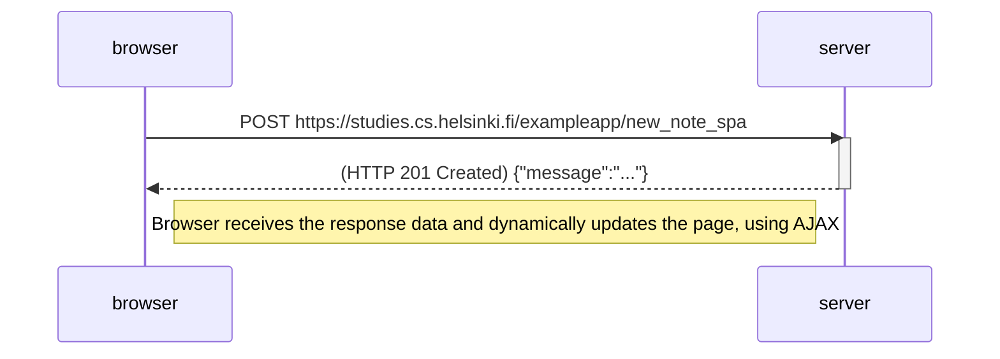

```mermaid
sequenceDiagram
    participant browser
    participant server

    browser ->>server: POST https://studies.cs.helsinki.fi/exampleapp/new_note_spa
    activate server
    server -->>browser: (HTTP 201 Created) {"message":"..."}
    deactivate server

    Note right of browser: Browser receives the response data and dynamically updates the page, using AJAX
```